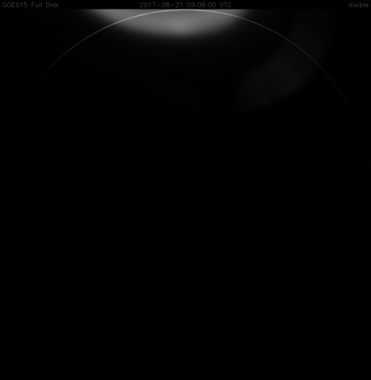

# goestools

Tools to work with signals and files from GOES satellites.

* **goesrecv**: Demodulate and decode signal into packet stream.
* **goeslrit**: Assemble LRIT files from packet stream.
* **goesproc**: Process LRIT files into plain files and images.

I started writing this to learn about things involved in the GOES
communication pipeline and in the process learn more about space
communication standards. Everything is written in C++ to strike a
balance between usability (no need for yet another hash table in C)
and performance. ~~Eventually it would be nice to run the entire RX
pipeline on a little ARM board.~~ The entire RX pipeline can run on a
Raspberry Pi 3.

## Requirements

System dependencies:

* CMake
* C++14 compiler
* OpenCV 2 (for image processing in goesproc)
* zlib (for EMWIN decompression)

Bundled dependencies:

* libcorrect (currently a fork with CMake related fixes)
* libaec

## Build

``` shell
git clone https://github.com/pietern/goestools
cd goestools
mkdir -p build
cd build
cmake ../ -DCMAKE_INSTALL_PREFIX=/usr/local
ls ./src/goesdec ./src/goesproc
```

## Usage

### goesrecv

As of February 2018 goesrecv only runs ARM processors with NEON
extensions (such as the Raspberry Pi 3). Stay tuned for compilation
instructions...

### goeslrit

> If you're interested in post-processed data (images, text files)
> then you can ignore `goeslrit` and only use `goesproc`.

This tool can be used to turn a stream of packets into LRIT files.
LRIT files can then be used by goesproc (or other tools, such as to
generate usable images and text files, or for debugging purposes.

It can either read packets from files to process recorded data, or
subscribe to `goesrecv` process to work with live data.

To make it write LRIT files to disk, you have to specify the category
of files you are interested in. Run `goeslrit --help` for a list of
filtering options. To make it write **ALL** LRIT files it seems, run
`goeslrit` with the `--all` option.

#### Reading packets from files

The files must be specified in chronological order because they are
read in order. Packets for a single LRIT file can span multiple packet
files, so if they are not specified in chronological order some LRIT
files will be dropped. Specifying a file glob in bash expands to an
alphabetically sorted list of file names that match the pattern.

Example with files:

``` shell
$ goeslrit --images /path/to/packets/packets-2018-02-28T*
Reading: /path/to/packets/packets-2018-02-28T00:00:00Z.raw
Writing: OR_ABI-L2-CMIPM1-M3C02_G16_s20180582358300_e20180582358358_c20180582358429.lrit (4004087 bytes)
Writing: OR_ABI-L2-CMIPM2-M3C07_G16_s20180590000000_e20180590000071_c20180590000108.lrit (254551 bytes)
...
```

#### Reading packets from a publisher

If `goesrecv` is running somewhere on your network, `goeslrit` can be
configured to subscribe to its packet publisher to process live data.
This is done with the `--subscribe` argument and it can take any valid
nanomsg address. Often this will be a TCP address
(`tcp://<ip>:<port>`, also see [nn_tcp(7)][nn_tcp]), but if you happen
to run `goesrecv` on the same machine as `goeslrit` you can also use
the IPC transport mechanism (`ipc://path/to/socket`, also see
[nn_ipc(7)][nn_ipc]).

[nn_tcp]: http://nanomsg.org/v1.1.2/nn_tcp.html
[nn_ipc]: http://nanomsg.org/v1.1.2/nn_ipc.html

Example with publisher:

``` shell
$ goeslrit --images --subscribe tcp://1.2.3.4:5005
Writing: OR_ABI-L2-CMIPM1-M3C02_G16_s20180591958303_e20180591958360_c20180591958427.lrit (4004087 bytes)
Writing: OR_ABI-L2-CMIPM2-M3C07_G16_s20180592000003_e20180592000073_c20180592000110.lrit (254551 bytes)
...
```

### goesproc

```
Usage: goesproc [OPTIONS] [path...]
Process stream of packets (VCDUs) or list of LRIT files.

Options:
  -c, --config PATH          Path to configuration file
  -m, --mode [packet|lrit]   Process stream of VCDU packets
                             or pre-assembled LRIT files
      --help                 Show this help

If mode is set to packet, goesproc reads VCDU packets from the
specified path(s). To process real time data you can setup a pipe from
the decoder into goesproc (e.g. use /dev/stdin as path argument).
To process recorded data you can specify a list of files that contain
VCDU packets in chronological order.

If mode is set to lrit, goesproc finds all LRIT files in the specified
paths and processes them sequentially. You can specify a mix of files
and directories. Directory arguments expand into the files they
contain that match the glob '*.lrit*'. The complete list of LRIT files
is sorted according to their time stamp header prior to processing it.
```

An example goesproc configuration file can be found at
[./etc/goesproc.conf](etc/goesproc.conf).

For example, with the following configuration file:

``` toml
[[handler]]
type = "image"
product = "goes15"
region = "fd"
channels = [ "VS" ]
crop = [ -2373, 2371, -1357, 1347 ]
filename = "GOES15_%r_%c_%t"
```

Running goesproc against a directory with GOES-15 LRIT files:

``` shell
$ goesproc --config example.conf --mode lrit ./out/images/goes15/fd
Writing ./GOES15_FD_VS_20170820-210600.png
Writing ./GOES15_FD_VS_20170821-000600.png
Writing ./GOES15_FD_VS_20170821-030600.png
Writing ./GOES15_FD_VS_20170821-060600.png
Writing ./GOES15_FD_VS_20170821-090600.png
Writing ./GOES15_FD_VS_20170821-120600.png
Writing ./GOES15_FD_VS_20170821-150600.png
Writing ./GOES15_FD_VS_20170821-180600.png
...
```

You can now use these image files however you like. For example, to
produce a GIF from 8 consecutive full disk images, you can use the
following ImageMagick commands:

``` shell
mogrify -resize '640x480>' *.png
convert -loop 0 -delay 50 *.png GOES15_FD_VS_20170821.gif
```



## Resources

All PDFs at http://www.noaasis.noaa.gov/LRIT/pdf-files/ are useful, in
particular the receiver specs, transmitter specs, and mission data
documents.

* http://www.noaasis.noaa.gov/LRIT/pdf-files/3_LRIT_Receiver-specs.pdf
* http://www.noaasis.noaa.gov/LRIT/pdf-files/4_LRIT_Transmitter-specs.pdf
* http://www.noaasis.noaa.gov/LRIT/pdf-files/5_LRIT_Mission-data.pdf

Also, these blog series:

* https://web.archive.org/web/20150426214432/http://www.acasper.org/2011/10/24/goes-satellite-decoding/
* http://www.teske.net.br/lucas/2016/10/goes-satellite-hunt-part-1-antenna-system/

### Reed-Solomon

From the LRIT receiver specs:

> The LRIT dissemination service is a Grade-2 service; therefore, the
> transmission of user data will be error controlled using
> Reed-Solomon coding as an outer code. The used Reed-Solomon code is
> (255,223) with an interleaving of I = 4.

Data must be transformed from Berlekamp's dual basis representation to
conventional representation before we can run the Reed-Solomon
algorithm provided by libcorrect.

Please refer to [CCSDS 101.0-B-6][CCSDS101.0-B-6] (Recommendation For
Space Data System Standards: Telemetry Channel Coding) to read more
about the Reed-Solomon specifics for this application, the dual basis
representation, and how to transform data between conventional
representation and dual basis representation.

[CCSDS101.0-B-6]: https://public.ccsds.org/Pubs/101x0b6s.pdf

## Acknowledgments

Thanks to [@lukasteske](https://twitter.com/lucasteske) for building
an open source demodulator and decoder (see [Open Satellite
Project][OSP]). I used his code to verify my antenna system and as
reference to cross check between the LRIT spec and his implementation.

[OSP]: https://github.com/opensatelliteproject
