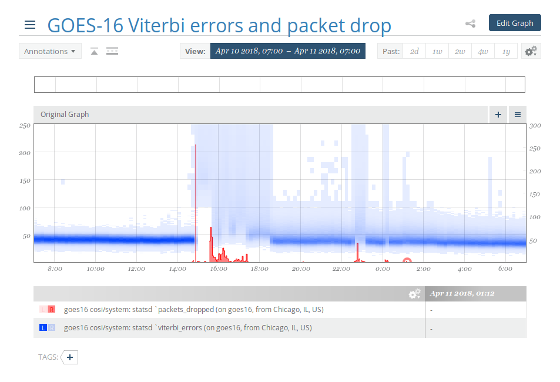
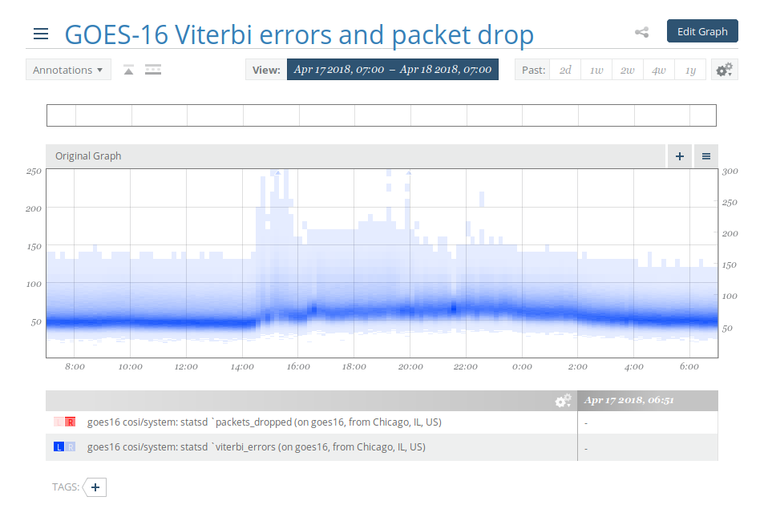

Monitoring goesrecv with Circonus
=================================

Circonus_ is a hosted graphing and monitoring tool. It has native
support for histograms which is ideal for looking at a distribution
over time. For goesrecv in particular, this is great for keeping track
of signal quality over time (e.g. distribution of Viterbi bit errors
per packet, packet drops, etc).

.. _circonus: https://www.circonus.com/

For example, for my GOES-16 receiver, it enabled me to compare the
performance of two different LNA configurations. Even though the new
configuration has a worse mean error rate, it does not get overloaded
when local interference happens, and leads to fewer packet drops.

Below you see the before and after graphs that show the distribution
of Viterbi bit error rate and the number of packet drops. The before
figure clearly has a lower mean bit error rate, but has really bad
outliers, that in turn cause packet drop. The after figure has a
higher mean bit error rate, but lacks the bad outliers, and has no
packet drop at all.

   **Before**

   **After**

Setup
-----

* Register for a Circonus account and log in
* Go to "new check"
* Use the Circonus One-Step Install (COSI)

COSI installs an agent on your machine. The agent tracks a set of
system metrics by default. It will also be the sink for the statsd
stats produced by goesrecv and forward them to Circonus.

Setup on Raspbian
-----------------

If you run goesrecv on Raspbian you have to install the agent
yourself. See https://www.circonus.com/2018/02/circonus-raspberry-pi/
for instructions. These instructions include a fixed version of Node
version 6, but newer versions have come out since. Find the latest
version at https://nodejs.org/dist/latest-v6.x/ and modify the
commands accordingly.

.. note::

   Run ``uname -a`` on your Raspberry Pi to see if you need the
   ``armv6l`` or ``arvm7l`` binaries.

The instructions are missing a ``mkdir``, run the following before starting:

.. code-block:: text

   sudo mkdir -p /opt/circonus/bin

If the agent is not yet running after the installation has finished,
try the following:

.. code-block:: text

   sudo systemctl daemon-reload
   sudo systemctl enable nad
   sudo systemctl start nad

Configuration
-------------

The statsd listener in the agent is enabled by default.

Ensure that your goesrecv configuration contains the following:

.. code-block:: toml

   [monitor]
   statsd_address = "udp4://localhost:8125"

After both the agent and goesrecv have run for a minute or so,
navigate to "Integrations", then "Checks", and then click on the check
you just added. Then click on "View Check Details" and subsequently
"Change Brokers & Metrics". Here you can enable the goesrecv stats you
care about.

Relevant demodulator stats:

* ``statsd.gain``
* ``statsd.frequency``
* ``statsd.omega``

Relevant decoder stats:

* ``statsd.viterbi_errors`` (enable as histogram)
* ``statsd.reed_solomon_errors`` (enable as histogram)
* ``statsd.packets_ok``
* ``statsd.packets_dropped``
