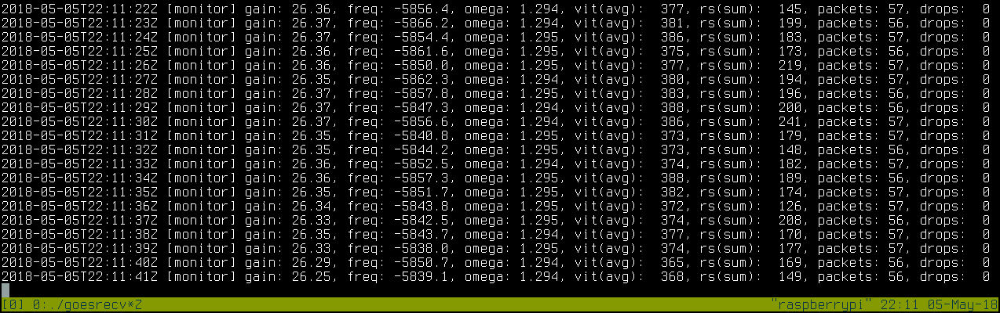
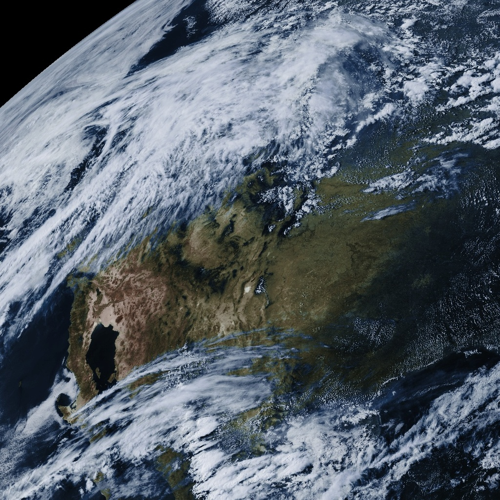

A minimal LRIT/HRIT receiver
============================

Receiving the LRIT and/or HRIT signal can be done with relatively
inexpensive equipment. This guide describes a minimal configuration
that I have confirmed to work. Reproducing this setup with new
components costs about $200 (excluding tax/shipping).

The bill of materials is as follows:

* Raspberry Pi 2 (v1.1+) or higher
* RTL-SDR with R820T2 tuner
* NooElec SAWbird with bias tee (LNA and filter board)
* L-Com 1.9 GHz Parabolic Grid Antenna
* Jumper/adapter from male Type N to male SMA (for antenna to LNA)
* Jumper/adapter from male SMA to male SMA (for LNA to RTL-SDR)

.. note::

   Additional items such as power supplies or mounting hardware
   are not listed here.

.. note::

   As of May 2018, the NooElec SAWbird is not yet listed in their
   shop. You can contact the NooElec sales department directly to
   order an engineering sample. The final units are expected to become
   generally available later this year.

.. important::

   The listed grid dish antenna works for me at my location (San
   Francisco Bay Area). I can receive GOES-15 at its west location,
   GOES-16 at its east location, and GOES-17 at its checkout location
   of 89 degrees west. GOES-16 is at about 25 degrees elevation. If
   your location has GOES-16 at a lower elevation, you may need a
   bigger dish. That said, even with GOES-16 at a higher elevation,
   there are other factors that can impact whether or not you can use
   this dish (blocked line of sight, local interference, etc).

   Find your local azimuth and elevation on `Satview`_
   (`GOES-15 <http://www.satview.org/?sat_id=36411U>`_,
   `GOES-16 <http://www.satview.org/?sat_id=41866U>`_,
   `GOES-17 <http://www.satview.org/?sat_id=43226U>`_).

.. _satview: http://www.satview.org/

Hardware
--------

The setup to test this configuration looked like this.

.. image:: minimal_zoomed.jpg
   :scale: 45 %
.. image:: minimal_overview.jpg
   :scale: 45 %

* The grid dish antenna has a female Type N connector so to connect it
  to the SAWbird we need a male Type N to male SMA adapter (in the
  picture you see the adapter and an SMA-M to SMA-M jumper).
* The NooElec SAWbird is connected to the grid dish antenna on the
  input and the RTL-SDR on the output. It is powered from the Pi over
  USB (the bias tee version of the SAWbird has a micro-USB connector).
* The RTL-SDR is connected to the SAWbird with an SMA-M to SMA-M
  jumper.
* In this setup, the Pi gets its power over USB.
* In this setup, the Pi is connected to the network over Ethernet.
* The laptop in the right image was only used to SSH into the Raspberry
  Pi.

.. note::

   The Raspberry Pi 2 v1.1 works, but it doesn't leave much margin on
   the processing power. You can only use it in combination with an
   RTL-SDR. If you want to use it with an Airspy, the receiver will
   drop packets due to its higher sampling rate of 3M samples/sec.

Software
--------

Raspbian works fine. There is no need for a desktop environment if you
only use the Pi for signal demodulation and decode, so you can use the
lite version. For instructions on building and installing goestools,
see :ref:`installation`.

After installing :ref:`goesrecv` and copying/modifying its
configuration file, run it with ``-v -i 1`` to get second-by-second
demodulator statistics. You can use the Viterbi error rate for
pointing your dish. A rate of ~2000 means there is no signal. A rate
of ~1000 may give you sporadic packets. A rate of ~400 can give you
the complete stream of packets without any drops, but is very
sensitive to interference. A rate of ~100 or lower is good and can
give you a packet stream without drops for hours on end. The lower the
Viterbi error rate, the better your signal. the better your signal.

The output of :ref:`goesrecv` during operation of the test setup:

The output of ``htop`` during signal lock:

.. image:: minimal_htop.png
   :scale: 90 %

To process the packet stream, see :ref:`goeslrit` and :ref:`goesproc`.

For example, this is the false color full disk received from GOES-16
and assembled by goesproc during this test (resized to 1024x1024 for
size constraints):

This is a crop of Northern America to get an impression of the
resolution of these full disk images:

Notes
-----

* For enclosures, check out `Bud Industries
  <https://www.budind.com/>`_ and `Hammond Manufacturing
  <https://www.hammfg.com/enclosures>`_.
* The power consumption of this setup is about 6 watts.
* Other ARM based single board computers should work fine as well as
  long as they have comparable (or better) performance to the
  Raspberry Pi 2.
* Empirical evidence shows that adding another LNA *after* the NooElec
  SAWbird improves signal quality (e.g. going from Viterbi error rate
  ~150 to ~100).
